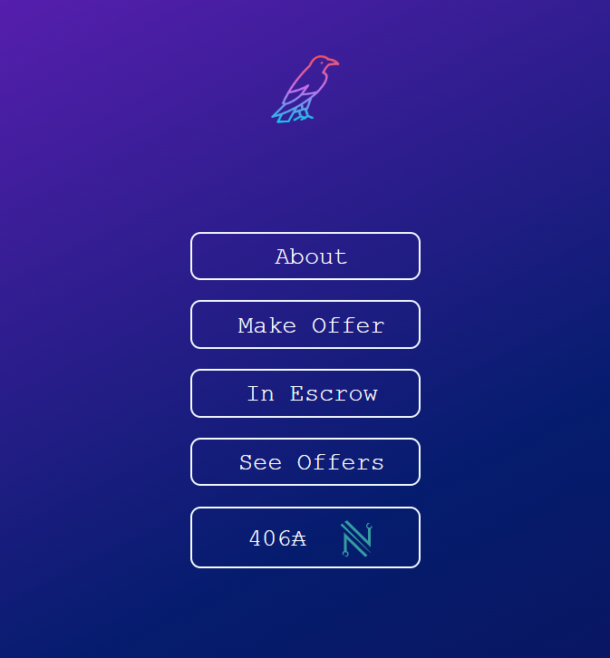

# Nescrow-Catalyst

Nescrow is a smart-contract Marketplace on the Cardano Blockchain. This repository was funded by the Catalyst Fund11 innovation grant.

The smart contract can be found in the v3_script folder in the [v3_nescrow_dex.py](/v3_script/v3_nescrow_dex.py) file 

The offchain API and ancilliary code can be found in the flask folder with the main API within the  [flask_nescrow_dex.py](/flask/flask_nescrow_dex.py)  file

The front-end next.JS code is located within the nescrow_dex_app folder with the main typescript file in the [src/pages/index.tsx ](/nescrow_dex_app/src/pages/index.tsx )   file

Comprehensive documentation of the smart-contract, offchain code, and the front-end website can be found in the Documentation Folder



##Prerequisites
```
#NVM/Node https://nodejs.org/en
#Next.JS  https://nextjs.org/docs/getting-started/installation
#Python3
```
## Build
Please refer https://blockfrost.io/  for generating mainnet and preprod keys
=======

```
mkdir dex_nescrow
cd dex_nescrow
mkdir nescrow_dex_app 
cd nescrow_dex_app
npx create-next-app@latest --typescript .
#follow prompts Yes,No,Yes,No,No
cd ..
git clone https://github.com/while0x1/Nescrow-Catalyst.git
mv Nescrow-Catalyst/flask flask
mv Nescrow-Catalyst/v3_script/ v3_script

#in nescrow_dex_app/src/pages directory
mv _app.tsx bk_app.tsx
mv _document.tsx bk_document.tsx
mv index.tsx bk_index.tsx

#in dex_nescrow directory 
mv Nescrow-Catalyst/nescrow_dex_app/src/pages/index.tsx nescrow_dex_app/src/pages/index.tsx
mv Nescrow-Catalyst/nescrow_dex_app/src/pages/_app.tsx nescrow_dex_app/src/pages/_app.tsx
mv Nescrow-Catalyst/nescrow_dex_app/src/pages/_document.tsx nescrow_dex_app/src/pages/_document.tsx

#in dex_nescrow/nescrow_dex_app
npm install @mui/material
npm install @mui/icons-material
npm install cbor
npm install @emotion/react
npm install @emotion/styled

#in ~/dex_necsrow/nescrow_dex_app/src/styles
mv globals.css bk_globals.css
mv Home.module.css bk_Home.module.css
#from /dex_necsrow
mv Nescrow-Catalyst/nescrow_dex_app/src/styles/globals.css nescrow_dex_app/src/styles/globals.css
mv Nescrow-Catalyst/nescrow_dex_app/src/styles/Home.module.css nescrow_dex_app/src/styles/Home.module.css
#from nescrow_dex_app folder
npm run dev
```

## Environment

Create a .env.local file in dex_nescrow/nescrow_dex_app folder

```
NEXT_PUBLIC_FLASK_AUTH = <your_flask_api_key>
```
for flask static_vars environment vars
```
#Replace with Your API password and contract parameters
FLASKAUTH = '<your_auth>'
FEE = '<your_fee>'
CANCEL_FEE = '<your_fee>'
FEEHASH = '<your_fee_hash>'
#Replace MAINNET WithYourBlockfrostKeys
BF_HEADERS = {'project_id': '<your_key>'}
BF_PROJ_ID =  '<your_key>'
FEE_ADDRESS = '<your_fee_address>'
#Replace PreProd
BF_HEADERS = {'project_id': '<your_preprod_key>'}
BF_PROJ_ID = '<your_preprod_key>'
#If Contract has changed updater REF_CBOR to your contracts CBOR reference utxo

#once your blockfrost keys and environment static variables are set from ~/dex_nescrow/flask
python3 flask_nescrow_dex.py
```
